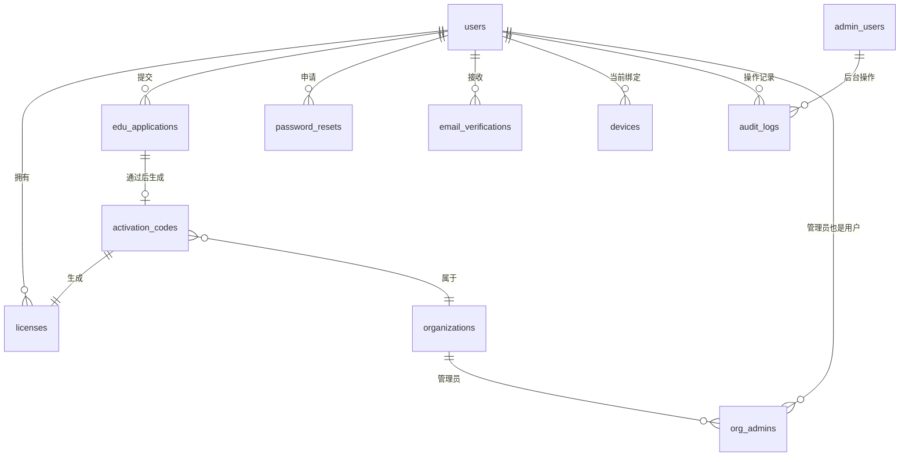
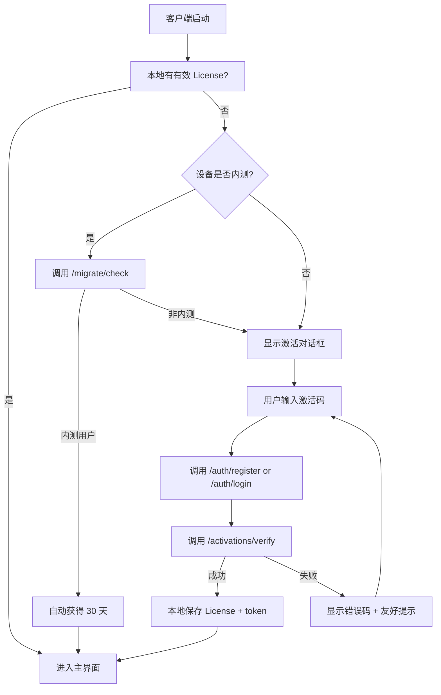
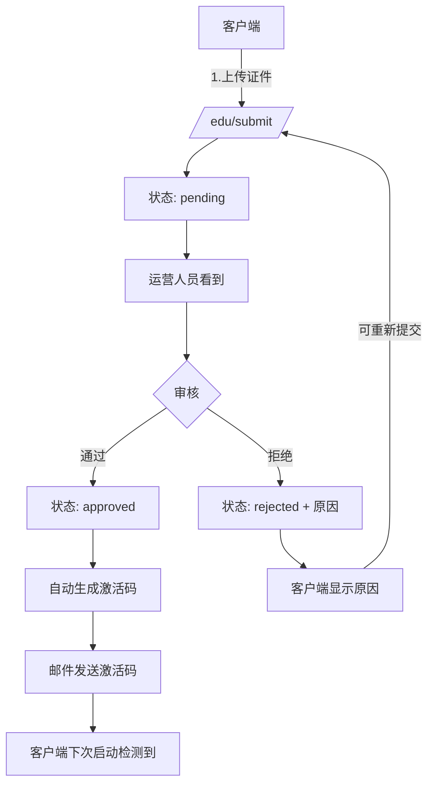
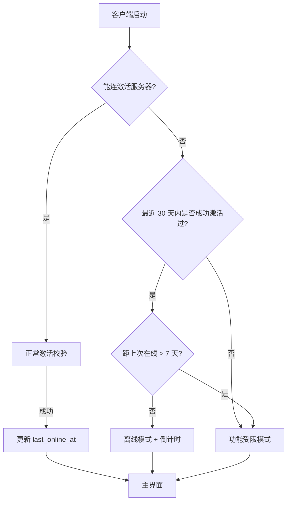
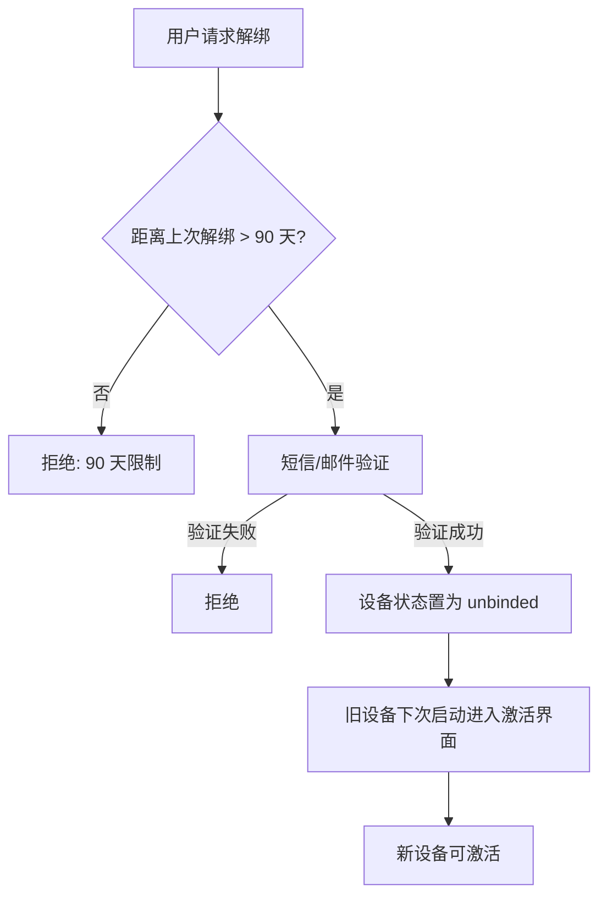

# Prismatica 授权后端 PRD

| 项目名称 | Prismatica 授权后端 |
|---------|-------------------|
| PRD 编号 | PRD-AUTH-001 |
| 版本号 | V1.0.0 |
| 创建日期 | 2026-07-19 |
| 作者 | Mavis（产品经理） |
| 状态 | 评审中 |
| 配套客户端 | Prismatica 桌面客户端 v1.0.0（PySide6） |
| 配套 PRD | `prismatica-v1.0-release-prd.md` |

---

## 修订记录

| 版本 | 日期 | 修订人 | 修订内容 |
|------|------|--------|----------|
| V0.1 | 2026-07-19 | Mavis | 初稿，配套 v1.0 正式版授权登录需求 |

---

## 目录

1. [项目背景](#一项目背景)
2. [需求概述](#二需求概述)
3. [用户故事](#三用户故事)
4. [MySQL 数据模型](#四mysql-数据模型)
5. [Flask API 设计](#五flask-api-设计)
6. [业务流程](#六业务流程)
7. [业务规则](#七业务规则)
8. [异常处理](#八异常处理)
9. [非功能需求](#九非功能需求)
10. [部署与运维](#十部署与运维)
11. [安全设计](#十一安全设计)
12. [附录](#十二附录)

---

## 一、项目背景

### 1.1 背景说明

**客户端现状**

Prismatica v1.0 内测版采用**纯本地 License 机制**：激活数据存于本机 `activation.dat`（AES-256-GCM 加密，密钥派生自设备指纹）。这种模式在内测期没有问题，但支撑正式版商业化时遇到 4 个核心障碍：

1. **支付无法闭环** — 客户端不能收款、不能开发票、不能接入微信/支付宝
2. **教育版审核无载体** — 教师资格证上传、审核、状态通知纯本地无法做
3. **机构版批量授权无工具** — 一份机构码同时激活 50 台电脑的流程必须在服务端
4. **内测用户迁移无依据** — 哪些用户是内测已激活、应享受 30 天赠送，后端必须有记录

**为什么是 Flask + MySQL**

- 团队技术栈统一 Python，Flask 学习成本低、生态成熟
- 业务量级小（首年预计日均 < 1 万次激活请求），单库 MySQL 足够
- 与客户端（PySide6 + hanlp-restful）共用 Python 工具链（uv、loguru、cryptography）
- 国内云厂商（阿里云 RDS / 腾讯云 MySQL）开箱即用，运维成本低

**业务定位**

本后端**只做用户授权登录相关**，不涉及：
- ❌ 语料内容存储（仍在客户端本地）
- ❌ 分析结果同步（仍在客户端本地）
- ❌ 协作功能（v2.0 规划）
- ❌ 支付订单系统（v1.0 早期接入第三方收银台，不自建订单库，v1.1 再自建）

### 1.2 项目目标

| 维度 | 量化指标 | 目标值 |
|------|---------|--------|
| 可用性 | API 可用性 | ≥ 99.5%（每月宕机 < 4 小时） |
| 性能 | 激活验证 P99 延迟 | < 500ms |
| 性能 | 峰值 QPS | ≥ 1000（按 10 倍预估） |
| 安全 | 通信加密 | 全部 HTTPS |
| 安全 | 密码存储 | bcrypt（cost ≥ 12） |
| 业务 | 内测用户迁移识别率 | 100% |
| 业务 | 激活码生成不重复率 | 100% |

### 1.3 范围边界

#### 包含（In Scope）

- 用户注册 / 登录（邮箱 + 密码）
- 用户基本信息管理（昵称、邮箱、手机号可选）
- 激活码管理（生成、查询、撤销、状态变更）
- 设备绑定（基于 device_id）
- 许可类型管理（试用 / 个人 / 教育 / 机构）
- 教育版教师证审核（人工审核工作台 + API）
- 机构版批量激活（生成批量激活码 + 验证）
- 内测用户识别与迁移标记
- 离线模式支持（已激活用户可断网使用 N 天）
- 激活日志 / 审计日志
- 简单的运营后台（运营人员用 Web 界面管理）

#### 不包含（Out of Scope）

- 支付系统（v1.0 接入微信支付收银台，本后端只接收回调）
- 订单详情管理（v1.1 自建）
- 发票系统（v1.1 接入第三方电子发票）
- 聊天/工单/社区（v2.0）
- 推送通知（v1.1）
- 数据分析大屏（v1.1）

---

## 二、需求概述

### 2.1 用户角色

| 角色 | 来源 | 核心诉求 |
|------|------|---------|
| **终端用户** | 客户端激活时自动注册 | 无感知注册、登录/找回密码、激活码使用 |
| **运营人员** | 内部 | 用户管理、激活码管理、教师证审核、订单查询 |
| **客服人员** | 内部 | 查询用户状态、补发激活码、退款处理 |
| **系统管理员** | 内部 | 后台账号管理、操作审计 |

> 说明：终端用户在客户端的体验是"激活码激活"，本后端为了支撑账号体系和教育版审核，在激活时会自动注册匿名账号（手机号/邮箱为可选项）。

### 2.2 功能架构

```
Prismatica Auth Backend (Flask + MySQL)
│
├── 用户模块
│   ├── 注册（手机/邮箱 + 密码）
│   ├── 登录（JWT）
│   ├── 找回密码（邮箱验证码）
│   └── 用户信息管理
│
├── 激活码模块
│   ├── 激活码生成（单条 / 批量）
│   ├── 激活验证（绑定设备）
│   ├── 激活码查询 / 撤销
│   └── 激活码类型（个人/教育/机构）
│
├── 设备模块
│   ├── 设备注册（device_id 唯一性）
│   ├── 设备绑定（一个激活码绑一台）
│   ├── 设备解绑（重置）
│   └── 设备信息上报（OS、版本、CPU）
│
├── 许可模块
│   ├── 许可状态查询
│   ├── 许可过期检测
│   ├── 离线宽限期管理
│   └── 续费 / 升级
│
├── 教育版审核模块
│   ├── 教师证上传（< 5MB PDF/JPG）
│   ├── 审核工作台（Web 界面）
│   ├── 审核状态通知
│   └── 自动 OCR 初审（v1.1）
│
├── 机构版模块
│   ├── 机构信息管理
│   ├── 批量激活码生成
│   ├── 机构用户管理
│   └── 激活码分发
│
├── 内测迁移模块
│   ├── 内测用户识别（device_id 比对）
│   ├── 30 天赠送标记
│   └── 迁移记录
│
├── 运营后台
│   ├── 登录（独立账号体系）
│   ├── 用户管理
│   ├── 激活码管理
│   ├── 教师证审核
│   ├── 订单查询
│   └── 审计日志
│
└── 系统模块
    ├── API 限流
    ├── 错误日志
    ├── 性能监控
    └── 定时任务（清理过期、发送提醒）
```

### 2.3 接口设计总览

所有接口均为 RESTful，路径前缀 `/api/v1`。

| 模块 | 路径 | 说明 |
|------|------|------|
| 用户 | `/api/v1/auth/*` | 注册、登录、找回密码 |
| 用户 | `/api/v1/users/*` | 用户信息、修改密码 |
| 激活码 | `/api/v1/activations/*` | 生成、查询、验证、撤销 |
| 设备 | `/api/v1/devices/*` | 注册、绑定、解绑 |
| 许可 | `/api/v1/licenses/*` | 状态查询、离线宽限期 |
| 教育 | `/api/v1/edu/*` | 教师证上传、审核状态 |
| 机构 | `/api/v1/org/*` | 机构信息、批量激活 |
| 内测 | `/api/v1/migrate/*` | 内测用户识别 |
| 后台 | `/api/v1/admin/*` | 运营管理（独立鉴权） |
| 公共 | `/api/v1/public/*` | 健康检查、版本、配置 |

---

## 三、用户故事

### US-101：客户端激活时自动注册

```
作为 Prismatica 桌面客户端用户
我想要 在输入激活码时不需要先注册账号
以便于 一键完成激活，不被注册流程打断

验收标准：
- Given 用户首次运行客户端
- When 用户在激活对话框输入激活码（可同时输入邮箱和密码）
- Then 后端创建用户记录（若邮箱不存在）
- And 激活码与 device_id 绑定
- And 返回 access_token + refresh_token
- And 客户端本地缓存 token 至下次启动
```

### US-102：激活码激活设备

```
作为 已购买个人版的用户
我想要 在新设备上使用我的激活码
以便于 更换电脑后能继续使用（但需先解绑旧设备）

验收标准：
- Given 用户已有有效激活码（未绑定或已解绑）
- And 用户在客户端输入激活码 + 设备指纹
- When 客户端请求 /api/v1/activations/verify
- Then 后端校验激活码状态（未使用 / 未过期 / 未撤销）
- And 校验设备数：个人版 1 台 / 教育版 1 台 / 机构版 N 台
- And 绑定成功：返回 license_record + 设备信息
- And 绑定失败：返回明确错误码（DEVICE_LIMIT / EXPIRED / REVOKED）
```

### US-103：找回密码

```
作为 忘记密码的用户
我想要 通过邮箱验证码重置密码
以便于 在不联系客服的情况下自助找回

验收标准：
- Given 用户提交"忘记密码"请求
- When 用户输入注册邮箱
- Then 后端生成 6 位验证码，5 分钟有效
- And 通过邮件发送（不直接返回验证码）
- And 用户提交验证码 + 新密码
- Then 验证通过则更新密码（bcrypt 重哈希）
- And 返回成功
- And 单 IP 单日最多 10 次请求（防爆破）
```

### US-104：教育版教师证审核

```
作为 高校对外汉语教师
我想要 上传教师证后 24 小时内收到审核结果
以便于 拿到教育版激活码

验收标准：
- Given 用户在客户端选择"教育版激活"
- When 用户填写姓名 + 院校 + 教师资格证号 + 上传证件（≤ 5MB）
- Then 提交至 /api/v1/edu/submit，返回审核单号
- And 状态：pending → reviewing → approved/rejected
- And 审核通过后自动生成教育版激活码，邮件发送
- And 审核被拒：用户可在客户端查看原因 + 重新提交（最多 3 次）
```

### US-105：机构管理员批量激活

```
作为 高校外国语学院设备管理员
我想要 一次性为 50 台电脑激活
以便于 避免逐台激活的繁琐

验收标准：
- Given 机构已在官网购买"机构版 50 站点"
- When 管理员登录机构后台
- And 输入 50 个 device_id（批量导入 CSV）
- Then 系统生成 50 份激活码，绑定到指定 device
- And 管理员可导出 50 份激活码 CSV
- And 每台电脑用对应激活码激活即可（无需联网激活）
```

### US-106：内测用户识别

```
作为 Prismatica 内测期已激活的设备
我想要 自动获得 30 天正式版体验
以便于 平稳过渡到正式版，无需手动操作

验收标准：
- Given 设备在内测期有过有效激活记录（device_id 在内测白名单中）
- When 设备首次启动 v1.0 正式版
- And 客户端请求 /api/v1/migrate/check
- Then 后端识别为内测用户，返回 trial_expire_at = now + 30 天
- And 客户端进入主界面
- And 数据库记录迁移时间
- And 30 天到期前 7 天，客户端提示升级
```

### US-107：离线模式

```
作为 已激活用户
我想要 在没有网络的情况下继续使用 7 天
以便于 出差/网络不稳定时不被打断

验收标准：
- Given 用户在最近 30 天内至少成功联网激活过 1 次
- When 客户端启动时无法连接激活服务器
- Then 进入"离线宽限期"模式（默认 7 天）
- And 客户端继续可用，所有功能正常
- And 离线倒计时显示在状态栏
- And 超过 7 天未联网：进入"功能受限"模式（可看已有数据，不可新建分析）
- And 重新联网后自动恢复
```

### US-108：运营人员审核教师证

```
作为 运营审核员
我想要 在 Web 后台批量处理待审教师证
以便于 高效完成教育版审核工作

验收标准：
- Given 审核员登录后台
- When 进入"教师证审核"页面
- Then 默认按提交时间升序展示待审列表
- And 可查看证件图片、姓名、院校、资格证号
- And 点击"通过"：状态变更为 approved，自动生成激活码并发邮件
- And 点击"拒绝"：填写原因（预设 5 个 + 自定义），状态变更为 rejected
- And 批量操作：勾选多个 → 批量通过 / 批量拒绝
- And 单条处理时长平均 ≤ 60 秒
```

### US-109：激活码撤销

```
作为 客服人员
我想要 撤销已发出的激活码
以便于 处理退款、违规等场景

验收标准：
- Given 客服登录后台
- When 输入激活码查询
- Then 显示绑定信息（用户、设备、激活时间）
- And 客服点击"撤销" + 填写原因
- Then 激活码状态变更为 revoked
- And 设备许可立即失效（下次客户端启动检测）
- And 撤销操作记入审计日志
```

### US-110：用户自助查询激活记录

```
作为 已激活用户
我想要 在客户端查看我的所有激活记录
以便于 了解自己有几个激活码、绑定了哪些设备

验收标准：
- Given 用户在客户端登录
- When 用户进入"我的授权"页面
- Then 显示：所有激活码（脱敏）、类型、绑定设备数、到期时间
- And 可点击"解绑设备"（每 90 天限 1 次，防滥用）
- And 可点击"导出授权信息"（JSON 格式，用于客服核对）
```

---

## 四、MySQL 数据模型

### 4.1 数据库总览

- **数据库名**：`prismatica_auth`
- **字符集**：`utf8mb4` / `utf8mb4_unicode_ci`
- **存储引擎**：`InnoDB`
- **表数量**：12 张核心表 + 3 张日志表

### 4.2 表结构设计

#### 4.2.1 `users` — 用户表

```sql
CREATE TABLE users (
    id              BIGINT UNSIGNED PRIMARY KEY AUTO_INCREMENT,
    uuid            CHAR(32) NOT NULL UNIQUE COMMENT '对外暴露的 UUID',
    email           VARCHAR(128) UNIQUE COMMENT '邮箱（可空，用于找回密码）',
    phone           VARCHAR(20) UNIQUE COMMENT '手机号（可空）',
    password_hash   VARCHAR(128) COMMENT 'bcrypt 哈希，cost=12',
    nickname        VARCHAR(64) DEFAULT '',
    avatar_url      VARCHAR(256) DEFAULT '',
    status          TINYINT DEFAULT 1 COMMENT '1=正常 0=禁用 2=注销',
    email_verified  TINYINT DEFAULT 0,
    phone_verified  TINYINT DEFAULT 0,
    is_internal     TINYINT DEFAULT 0 COMMENT '内部账号标识',
    last_login_at   DATETIME,
    last_login_ip   VARCHAR(45),
    created_at      DATETIME DEFAULT CURRENT_TIMESTAMP,
    updated_at      DATETIME DEFAULT CURRENT_TIMESTAMP ON UPDATE CURRENT_TIMESTAMP,
    deleted_at      DATETIME COMMENT '软删除',
    INDEX idx_email (email),
    INDEX idx_phone (phone),
    INDEX idx_status_created (status, created_at)
) ENGINE=InnoDB DEFAULT CHARSET=utf8mb4 COMMENT='用户表';
```

#### 4.2.2 `devices` — 设备表

```sql
CREATE TABLE devices (
    id              BIGINT UNSIGNED PRIMARY KEY AUTO_INCREMENT,
    device_id       VARCHAR(64) NOT NULL UNIQUE COMMENT '客户端生成的设备指纹',
    user_id         BIGINT UNSIGNED COMMENT '当前绑定用户，可空（未登录）',
    os              VARCHAR(32) COMMENT 'windows/macos/linux',
    os_version      VARCHAR(64),
    app_version     VARCHAR(32),
    cpu_arch        VARCHAR(32) COMMENT 'x86_64/arm64',
    hostname        VARCHAR(128) COMMENT '设备名（脱敏）',
    first_seen_at   DATETIME,
    last_seen_at    DATETIME,
    is_beta          TINYINT DEFAULT 0 COMMENT '是否内测设备',
    created_at      DATETIME DEFAULT CURRENT_TIMESTAMP,
    updated_at      DATETIME DEFAULT CURRENT_TIMESTAMP ON UPDATE CURRENT_TIMESTAMP,
    INDEX idx_user (user_id),
    INDEX idx_os (os),
    INDEX idx_beta (is_beta, last_seen_at)
) ENGINE=InnoDB DEFAULT CHARSET=utf8mb4 COMMENT='设备表';
```

#### 4.2.3 `activation_codes` — 激活码表

```sql
CREATE TABLE activation_codes (
    id              BIGINT UNSIGNED PRIMARY KEY AUTO_INCREMENT,
    code            VARCHAR(32) NOT NULL UNIQUE COMMENT '激活码（脱敏存储）',
    code_hash       VARCHAR(128) NOT NULL COMMENT 'bcrypt 哈希，校验时用',
    license_type    TINYINT NOT NULL COMMENT '1=试用 2=个人 3=教育 4=机构',
    status          TINYINT DEFAULT 1 COMMENT '1=未用 2=已用 3=撤销 4=过期',
    duration_days   INT COMMENT '有效天数，NULL=永久',
    expire_at       DATETIME COMMENT '到期时间',
    used_at         DATETIME,
    used_by_user_id BIGINT UNSIGNED,
    used_by_device  VARCHAR(64),
    order_id        VARCHAR(64) COMMENT '关联订单',
    org_id          BIGINT UNSIGNED COMMENT '所属机构',
    source          VARCHAR(32) COMMENT 'manual/payment/edu_approve/migrate/beta',
    notes           VARCHAR(256),
    created_by      BIGINT UNSIGNED COMMENT '创建人（运营/系统）',
    created_at      DATETIME DEFAULT CURRENT_TIMESTAMP,
    updated_at      DATETIME DEFAULT CURRENT_TIMESTAMP ON UPDATE CURRENT_TIMESTAMP,
    INDEX idx_status (status),
    INDEX idx_type (license_type),
    INDEX idx_expire (expire_at),
    INDEX idx_order (order_id)
) ENGINE=InnoDB DEFAULT CHARSET=utf8mb4 COMMENT='激活码表';
```

#### 4.2.4 `licenses` — 许可记录表

```sql
CREATE TABLE licenses (
    id              BIGINT UNSIGNED PRIMARY KEY AUTO_INCREMENT,
    user_id         BIGINT UNSIGNED NOT NULL,
    activation_id   BIGINT UNSIGNED NOT NULL,
    device_id       VARCHAR(64) NOT NULL,
    license_type    TINYINT NOT NULL,
    status          TINYINT DEFAULT 1 COMMENT '1=有效 2=过期 3=撤销 4=替换',
    activated_at    DATETIME NOT NULL,
    expire_at       DATETIME COMMENT 'NULL=永久',
    offline_grace_days INT DEFAULT 7 COMMENT '离线宽限期天数',
    last_online_at  DATETIME,
    metadata        JSON COMMENT '扩展字段',
    created_at      DATETIME DEFAULT CURRENT_TIMESTAMP,
    updated_at      DATETIME DEFAULT CURRENT_TIMESTAMP ON UPDATE CURRENT_TIMESTAMP,
    UNIQUE KEY uk_user_device (user_id, device_id, status),
    INDEX idx_device (device_id),
    INDEX idx_expire (expire_at, status)
) ENGINE=InnoDB DEFAULT CHARSET=utf8mb4 COMMENT='许可记录表';
```

#### 4.2.5 `edu_applications` — 教育版申请表

```sql
CREATE TABLE edu_applications (
    id              BIGINT UNSIGNED PRIMARY KEY AUTO_INCREMENT,
    user_id         BIGINT UNSIGNED NOT NULL,
    real_name       VARCHAR(64) NOT NULL,
    institution     VARCHAR(128) NOT NULL COMMENT '院校',
    title           VARCHAR(64) COMMENT '职称',
    cert_no         VARCHAR(64) NOT NULL COMMENT '教师资格证号',
    cert_file_url   VARCHAR(256) NOT NULL COMMENT '证件图片/ PDF',
    status          TINYINT DEFAULT 1 COMMENT '1=待审 2=审核中 3=通过 4=拒绝',
    reject_reason   VARCHAR(256),
    reviewed_by     BIGINT UNSIGNED,
    reviewed_at     DATETIME,
    submitted_count TINYINT DEFAULT 1 COMMENT '提交次数',
    generated_code_id BIGINT UNSIGNED COMMENT '通过后生成的激活码',
    created_at      DATETIME DEFAULT CURRENT_TIMESTAMP,
    updated_at      DATETIME DEFAULT CURRENT_TIMESTAMP ON UPDATE CURRENT_TIMESTAMP,
    INDEX idx_status (status, created_at),
    INDEX idx_user (user_id)
) ENGINE=InnoDB DEFAULT CHARSET=utf8mb4 COMMENT='教育版申请表';
```

#### 4.2.6 `organizations` — 机构表

```sql
CREATE TABLE organizations (
    id              BIGINT UNSIGNED PRIMARY KEY AUTO_INCREMENT,
    name            VARCHAR(128) NOT NULL COMMENT '机构名称',
    contact_name    VARCHAR(64),
    contact_phone   VARCHAR(20),
    contact_email   VARCHAR(128),
    license_quota   INT NOT NULL COMMENT '许可额度（站点数）',
    license_used    INT DEFAULT 0,
    expire_at       DATETIME,
    status          TINYINT DEFAULT 1 COMMENT '1=正常 0=禁用',
    contract_url    VARCHAR(256) COMMENT '合同附件',
    notes           TEXT,
    created_at      DATETIME DEFAULT CURRENT_TIMESTAMP,
    updated_at      DATETIME DEFAULT CURRENT_TIMESTAMP ON UPDATE CURRENT_TIMESTAMP,
    INDEX idx_name (name),
    INDEX idx_status (status)
) ENGINE=InnoDB DEFAULT CHARSET=utf8mb4 COMMENT='机构表';
```

#### 4.2.7 `org_admins` — 机构管理员表

```sql
CREATE TABLE org_admins (
    id              BIGINT UNSIGNED PRIMARY KEY AUTO_INCREMENT,
    org_id          BIGINT UNSIGNED NOT NULL,
    user_id         BIGINT UNSIGNED NOT NULL,
    role            TINYINT DEFAULT 1 COMMENT '1=主管理员 2=子管理员',
    status          TINYINT DEFAULT 1,
    created_at      DATETIME DEFAULT CURRENT_TIMESTAMP,
    UNIQUE KEY uk_org_user (org_id, user_id)
) ENGINE=InnoDB DEFAULT CHARSET=utf8mb4 COMMENT='机构管理员表';
```

#### 4.2.8 `email_verifications` — 邮箱验证码表

```sql
CREATE TABLE email_verifications (
    id              BIGINT UNSIGNED PRIMARY KEY AUTO_INCREMENT,
    email           VARCHAR(128) NOT NULL,
    code            VARCHAR(8) NOT NULL,
    purpose         TINYINT NOT NULL COMMENT '1=注册 2=找回密码 3=换绑',
    expires_at      DATETIME NOT NULL,
    used_at         DATETIME,
    attempts        INT DEFAULT 0 COMMENT '已尝试次数',
    ip              VARCHAR(45),
    created_at      DATETIME DEFAULT CURRENT_TIMESTAMP,
    INDEX idx_email_purpose (email, purpose, created_at)
) ENGINE=InnoDB DEFAULT CHARSET=utf8mb4 COMMENT='邮箱验证码';
```

#### 4.2.9 `password_resets` — 密码重置记录

```sql
CREATE TABLE password_resets (
    id              BIGINT UNSIGNED PRIMARY KEY AUTO_INCREMENT,
    user_id         BIGINT UNSIGNED NOT NULL,
    token_hash      VARCHAR(128) NOT NULL,
    expires_at      DATETIME NOT NULL,
    used_at         DATETIME,
    ip              VARCHAR(45),
    created_at      DATETIME DEFAULT CURRENT_TIMESTAMP
) ENGINE=InnoDB DEFAULT CHARSET=utf8mb4 COMMENT='密码重置';
```

#### 4.2.10 `audit_logs` — 审计日志

```sql
CREATE TABLE audit_logs (
    id              BIGINT UNSIGNED PRIMARY KEY AUTO_INCREMENT,
    actor_type      VARCHAR(16) NOT NULL COMMENT 'user/admin/system',
    actor_id        BIGINT UNSIGNED,
    action          VARCHAR(64) NOT NULL COMMENT 'login/activate/reset_password/...',
    target_type     VARCHAR(32),
    target_id       VARCHAR(64),
    metadata        JSON,
    ip              VARCHAR(45),
    user_agent      VARCHAR(256),
    result          TINYINT COMMENT '1=成功 0=失败',
    created_at      DATETIME DEFAULT CURRENT_TIMESTAMP,
    INDEX idx_actor (actor_type, actor_id, created_at),
    INDEX idx_action (action, created_at)
) ENGINE=InnoDB DEFAULT CHARSET=utf8mb4 COMMENT='审计日志';
```

#### 4.2.11 `admin_users` — 后台账号

```sql
CREATE TABLE admin_users (
    id              BIGINT UNSIGNED PRIMARY KEY AUTO_INCREMENT,
    username        VARCHAR(64) NOT NULL UNIQUE,
    password_hash   VARCHAR(128) NOT NULL,
    real_name       VARCHAR(64),
    email           VARCHAR(128),
    role            VARCHAR(32) NOT NULL COMMENT 'super_admin/operator/cs',
    status          TINYINT DEFAULT 1,
    last_login_at   DATETIME,
    created_at      DATETIME DEFAULT CURRENT_TIMESTAMP,
    updated_at      DATETIME DEFAULT CURRENT_TIMESTAMP ON UPDATE CURRENT_TIMESTAMP
) ENGINE=InnoDB DEFAULT CHARSET=utf8mb4 COMMENT='后台账号';
```

#### 4.2.12 `system_configs` — 系统配置

```sql
CREATE TABLE system_configs (
    id              BIGINT UNSIGNED PRIMARY KEY AUTO_INCREMENT,
    config_key      VARCHAR(64) NOT NULL UNIQUE,
    config_value    TEXT,
    description     VARCHAR(256),
    updated_by      BIGINT UNSIGNED,
    updated_at      DATETIME DEFAULT CURRENT_TIMESTAMP ON UPDATE CURRENT_TIMESTAMP
) ENGINE=InnoDB DEFAULT CHARSET=utf8mb4 COMMENT='系统配置（KV）';
```

#### 4.2.13 三张日志表

- `api_access_logs` — API 访问日志（按月分区）
- `error_logs` — 错误日志
- `crash_reports` — 崩溃报告（v1.0 可选）

### 4.3 ER 关系图



---

## 五、Flask API 设计

### 5.1 设计原则

- **RESTful 风格**：资源用名词、动作用 HTTP Method
- **统一响应格式**：
  ```json
  {
    "code": 0,
    "message": "ok",
    "data": { ... }
  }
  ```
- **错误码体系**：`0` 成功，正数业务错误，负数系统错误
- **认证方式**：JWT（access 2h + refresh 30d）
- **API 版本**：URL 前缀 `/api/v1`
- **限流**：默认 60 次/分钟/IP，关键接口（登录/激活）10 次/分钟/IP

### 5.2 接口清单

#### 5.2.1 用户模块 `/api/v1/auth`

| 方法 | 路径 | 说明 | 鉴权 |
|------|------|------|------|
| POST | `/auth/register` | 邮箱注册 | 无 |
| POST | `/auth/login` | 登录 | 无 |
| POST | `/auth/refresh` | 刷新 token | refresh |
| POST | `/auth/logout` | 登出 | access |
| POST | `/auth/forgot-password` | 忘记密码（发邮件） | 无 |
| POST | `/auth/reset-password` | 重置密码 | 无 |

**POST /api/v1/auth/register**

```json
// Request
{
  "email": "user@example.com",
  "password": "******",
  "nickname": "张三",
  "device_id": "abc123..."  // 客户端设备指纹
}

// Response
{
  "code": 0,
  "message": "ok",
  "data": {
    "user": { "uuid": "...", "email": "...", "nickname": "..." },
    "access_token": "...",
    "refresh_token": "..."
  }
}
```

**POST /api/v1/auth/login**

```json
// Request
{
  "email": "user@example.com",
  "password": "******",
  "device_id": "abc123..."
}

// Response（成功）
{
  "code": 0,
  "data": {
    "user": {...},
    "access_token": "...",
    "refresh_token": "..."
  }
}

// Response（密码错误）
{
  "code": 10001,
  "message": "邮箱或密码错误"
}
```

#### 5.2.2 用户管理 `/api/v1/users`

| 方法 | 路径 | 说明 | 鉴权 |
|------|------|------|------|
| GET | `/users/me` | 获取当前用户信息 | access |
| PATCH | `/users/me` | 修改昵称/头像 | access |
| POST | `/users/me/password` | 修改密码 | access |
| GET | `/users/me/licenses` | 我的所有许可 | access |
| GET | `/users/me/devices` | 我的所有设备 | access |
| POST | `/users/me/devices/{device_id}/unbind` | 解绑设备 | access |

#### 5.2.3 激活码模块 `/api/v1/activations`

| 方法 | 路径 | 说明 | 鉴权 |
|------|------|------|------|
| POST | `/activations/verify` | 验证并激活（客户端主用） | access |
| GET | `/activations/{code}/status` | 查询激活码状态 | access |
| POST | `/activations/batch-generate` | 批量生成（机构用） | org_admin |
| GET | `/activations` | 列表查询（后台） | admin |

**POST /api/v1/activations/verify**（核心接口）

```json
// Request
{
  "code": "PRSM-XXXX-XXXX-XXXX",
  "device_id": "abc123...",
  "device_info": {
    "os": "windows",
    "os_version": "11",
    "app_version": "1.0.0",
    "cpu_arch": "x86_64",
    "hostname": "USER-PC"
  }
}

// Response（成功）
{
  "code": 0,
  "data": {
    "license_id": 12345,
    "license_type": 2,  // 1=试用 2=个人 3=教育 4=机构
    "license_type_name": "个人版",
    "activated_at": "2026-10-25T10:00:00Z",
    "expire_at": null,  // 永久
    "offline_grace_days": 7
  }
}

// Response（设备超限）
{
  "code": 10101,
  "message": "个人版仅支持 1 台设备，请先解绑旧设备",
  "data": {
    "current_device_count": 1,
    "max_device_count": 1
  }
}

// Response（激活码过期）
{
  "code": 10102,
  "message": "激活码已过期"
}

// Response（激活码已撤销）
{
  "code": 10103,
  "message": "激活码已被撤销"
}
```

#### 5.2.4 设备模块 `/api/v1/devices`

| 方法 | 路径 | 说明 | 鉴权 |
|------|------|------|------|
| POST | `/devices/register` | 设备注册 | access |
| GET | `/devices/{id}` | 设备详情 | access |
| PATCH | `/devices/{id}/heartbeat` | 心跳（在线状态） | access |

#### 5.2.5 教育版 `/api/v1/edu`

| 方法 | 路径 | 说明 | 鉴权 |
|------|------|------|------|
| POST | `/edu/submit` | 提交教师证 | access |
| GET | `/edu/application/{id}` | 查询申请状态 | access |
| GET | `/edu/applications` | 申请列表（后台） | admin |
| POST | `/edu/applications/{id}/review` | 审核（后台） | admin |

**POST /api/v1/edu/submit**

```json
// Request (multipart/form-data)
{
  "real_name": "李四",
  "institution": "北京语言大学",
  "title": "副教授",
  "cert_no": "20191123456789",
  "cert_file": <binary>  // ≤ 5MB
}

// Response
{
  "code": 0,
  "data": {
    "application_id": 8888,
    "status": "pending",
    "estimated_review_hours": 24
  }
}
```

#### 5.2.6 机构版 `/api/v1/org`

| 方法 | 路径 | 说明 | 鉴权 |
|------|------|------|------|
| GET | `/org/me` | 我的机构信息 | org_admin |
| POST | `/org/batch-activate` | 批量激活 | org_admin |
| GET | `/org/activations` | 机构激活码列表 | org_admin |
| GET | `/org/usage` | 额度使用情况 | org_admin |

**POST /api/v1/org/batch-activate**

```json
// Request
{
  "device_ids": ["dev001", "dev002", ..., "dev050"]
}

// Response
{
  "code": 0,
  "data": {
    "batch_id": "BATCH-20261025-001",
    "total": 50,
    "success": 50,
    "failed": 0,
    "codes": [
      { "device_id": "dev001", "code": "PRSM-..." },
      ...
    ]
  }
}
```

#### 5.2.7 内测迁移 `/api/v1/migrate`

| 方法 | 路径 | 说明 | 鉴权 |
|------|------|------|------|
| POST | `/migrate/check` | 检查是否内测用户 | 无（用 device_id） |

**POST /api/v1/migrate/check**

```json
// Request
{
  "device_id": "abc123..."
}

// Response
{
  "code": 0,
  "data": {
    "is_beta_user": true,
    "trial_expire_at": "2026-11-25T00:00:00Z",
    "days_remaining": 30
  }
}
```

#### 5.2.8 公共 `/api/v1/public`

| 方法 | 路径 | 说明 |
|------|------|------|
| GET | `/public/health` | 健康检查 |
| GET | `/public/config` | 客户端配置（API 域名、限流阈值等） |
| GET | `/public/version` | 最新版本号（用于自动更新） |

### 5.3 错误码规范

| 范围 | 含义 | 示例 |
|------|------|------|
| `0` | 成功 | - |
| `1xxxx` | 用户/认证错误 | 10001 密码错误、10002 token 无效 |
| `10xxx` | 激活/许可错误 | 10101 设备超限、10102 已过期 |
| `11xxx` | 教育版错误 | 11101 重复提交、11102 审核被拒 |
| `12xxx` | 机构版错误 | 12101 额度不足 |
| `20xxx` | 业务校验错误 | 20001 参数错误、20002 频率超限 |
| `-1xxx` | 系统错误 | -1001 数据库异常、-1002 内部异常 |

---

## 六、业务流程

### 6.1 客户端激活流程



### 6.2 教育版审核流程



### 6.3 离线宽限期管理



### 6.4 设备解绑流程



---

## 七、业务规则

### 7.1 激活码规则

| 类型 | 时长 | 设备数 | 验证方式 | 备注 |
|------|------|--------|---------|------|
| 试用 | 14 天 | 1 | 在线激活 | 自动生成 |
| 个人 | 永久 | 1 | 在线激活 | 一次解绑/90 天 |
| 教育 | 永久 | 1 | 在线激活 | 需审核通过 |
| 机构 | 1 年 | N | 可离线 | N=购买站点数 |

### 7.2 设备绑定规则

- 一个激活码绑定的设备数为该类型允许的最大设备数
- 个人/教育版：1 台
- 机构版：按购买的站点数
- **换机规则**：每 90 天可自助解绑 1 次（防滥用 + 防黑产）
- **超限处理**：返回明确错误码 + 解绑指引

### 7.3 离线宽限期规则

- 触发条件：客户端无法连接激活服务器
- 宽限天数：默认 7 天
- 资格：最近 30 天内至少成功激活过 1 次
- 倒计时显示：状态栏展示剩余天数
- 超期处理：功能受限模式（只读，不可新建分析）
- 恢复条件：重新联网 + 激活成功

### 7.4 教育版审核规则

- 提交次数限制：每用户最多 3 次被拒机会
- 审核时效：24 小时内（工作时间）
- 审核维度：姓名+院校+资格证号+证件图片
- 拒绝原因预设：证件模糊 / 院校不符 / 资格证号无效 / 非教育行业
- 通过后：自动生成激活码 + 邮件发送 + 状态通知

### 7.5 密码规则

- 长度：8-32 位
- 复杂度：必须包含字母 + 数字
- bcrypt cost：12
- 单 IP 失败锁定：10 次/小时
- 找回密码：邮箱验证码（5 分钟有效）

### 7.6 限流规则

| 接口 | 限流 | 触发后行为 |
|------|------|-----------|
| `/auth/login` | 10 次/分钟/IP | 返回 429 |
| `/auth/register` | 5 次/小时/IP | 返回 429 |
| `/auth/forgot-password` | 10 次/天/IP | 返回 429 |
| `/activations/verify` | 30 次/小时/用户 | 返回 429 |
| `/edu/submit` | 3 次/天/用户 | 返回 429 |
| 其他 | 60 次/分钟/IP | 返回 429 |

---

## 八、异常处理

| 异常场景 | 触发条件 | 处理方式 | 用户提示 |
|---------|---------|---------|---------|
| 数据库连接失败 | MySQL down / 网络 | 5xx 返回 | "服务暂时不可用，请稍后重试" |
| JWT 过期 | access_token 超时 | 401 + 提示刷新 | "登录已过期，请重新登录" |
| 激活码无效 | code 不存在/已用/已撤销 | 明确错误码 | "激活码无效，请检查输入" |
| 设备超限 | 个人/教育版 > 1 台 | 10101 | "个人版仅支持 1 台设备，请先解绑旧设备" |
| 教师证审核超时 | 24 小时未审 | 自动提醒运营 | "审核中，预计 24 小时内完成" |
| 邮件发送失败 | SMTP 故障 | 重试 3 次 + 失败告警 | 客户端不受影响，运营可手动补发 |
| 离线宽限期已过 | 7 天 + 未联网 | 返回 10201 | "请连接网络验证授权" |
| 客户端版本过低 | < 1.0.0 | 拒绝激活 + 提示更新 | "请升级到最新版本" |
| 机构额度超限 | 激活数 > 购买数 | 12101 | "机构激活额度已用完，请联系管理员" |
| 短信发送失败 | 短信网关故障 | 降级到邮件 | 用户可切换找回方式 |

---

## 九、非功能需求

### 9.1 性能

| 指标 | 要求 |
|------|------|
| 激活验证 P99 延迟 | < 500ms |
| 登录 P99 延迟 | < 800ms |
| 教师证审核页面加载 | < 1.5s |
| 批量激活（50 台） | < 5s |
| 峰值 QPS | ≥ 1000 |
| 数据库连接池 | 20-100 动态 |

### 9.2 可用性

- API 可用性 ≥ 99.5%（每月宕机 < 4 小时）
- 计划性维护：提前 24 小时公告
- 故障响应：P0 故障 30 分钟内响应，4 小时内恢复

### 9.3 兼容性

- Python 3.11+
- Flask 3.x
- SQLAlchemy 2.x（ORM）
- Alembic（数据库迁移）
- PyMySQL（MySQL 驱动）
- 支持 MySQL 8.0+

### 9.4 安全

- 通信：全站 HTTPS（Let's Encrypt / 阿里云 SSL）
- 密码：bcrypt cost=12
- 激活码：bcrypt 哈希存储
- JWT：access 2h + refresh 30d，refresh 滚动续期
- 限流：基于 Redis（滑动窗口）
- SQL 注入：全部走 ORM + 参数化
- XSS：响应统一 JSON，不渲染 HTML
- CSRF：API 无状态，依赖 JWT；Web 后台用 SameSite Cookie + CSRF Token
- 审计日志：所有写操作入库，保留 ≥ 1 年

### 9.5 可观测性

- 应用日志：loguru 结构化（JSON）
- 错误监控：Sentry（可选）/ 自建
- 性能监控：APM 工具（可选 SkyWalking / 自建）
- 业务指标：自定义埋点 + 定时统计脚本

### 9.6 可维护性

- 代码结构：Blueprint 拆分模块
- 数据库迁移：Alembic
- API 文档：OpenAPI 3.0 + Swagger UI（`/api/docs`）
- 配置管理：12-factor，从环境变量读取
- 单元测试：核心业务 ≥ 60% 覆盖率

---

## 十、部署与运维

### 10.1 部署架构

```
                  ┌──────────────────┐
                  │   CDN / WAF      │
                  │  (DDoS 防护)      │
                  └─────────┬────────┘
                            │
                  ┌─────────▼────────┐
                  │   Nginx (HTTPS)  │
                  │   反向代理        │
                  └─────────┬────────┘
                            │
                ┌───────────┴───────────┐
                │                       │
        ┌───────▼────────┐    ┌────────▼─────────┐
        │  Gunicorn 实例1 │    │  Gunicorn 实例2   │  (Flask app)
        │  (4 worker)    │    │  (4 worker)       │
        └───────┬────────┘    └────────┬──────────┘
                │                       │
                └───────────┬───────────┘
                            │
                  ┌─────────▼────────┐
                  │   MySQL 8.0      │
                  │   (主从/主主)     │
                  └─────────┬────────┘
                            │
                  ┌─────────▼────────┐
                  │     Redis 6+     │  (限流/Session)
                  └──────────────────┘
```

### 10.2 部署环境

| 环境 | 用途 | 配置 |
|------|------|------|
| **dev** | 开发自测 | 单实例 + SQLite（开发期） |
| **staging** | 预发测试 | 单实例 + MySQL（同生产配置） |
| **prod** | 生产 | 2 实例 + MySQL 主从 + Redis |

### 10.3 部署方式

- **镜像**：Docker（`python:3.11-slim` 基础镜像）
- **编排**：Docker Compose（v1.0 阶段）/ Kubernetes（v1.1 阶段）
- **CI/CD**：GitHub Actions（lint → test → build → deploy）
- **回滚**：保留最近 5 个镜像版本，一键回滚

### 10.4 监控告警

| 监控项 | 阈值 | 告警 |
|--------|------|------|
| API 5xx 错误率 | > 1% | 钉钉 + 短信 |
| MySQL 连接数 | > 80% | 钉钉 |
| Redis 内存 | > 70% | 钉钉 |
| 磁盘使用 | > 80% | 钉钉 |
| API P99 延迟 | > 1s | 钉钉 |
| 激活失败率 | > 5% | 钉钉 |
| CPU 使用 | > 80%（持续 5 分钟） | 钉钉 |

### 10.5 备份策略

- MySQL：每日全量 + 实时 binlog，保留 30 天
- 配置文件：Git 管理
- 日志：本地 + OSS 归档，保留 90 天
- 恢复演练：每季度 1 次

---

## 十一、安全设计

### 11.1 安全分层

| 层级 | 措施 |
|------|------|
| 网络层 | HTTPS + WAF + 限流 + DDoS 防护 |
| 应用层 | 鉴权（JWT）+ 权限（RBAC）+ 参数校验 + 防注入 |
| 数据层 | 加密存储（密码/激活码）+ 脱敏（日志）+ 备份 |
| 运维层 | 操作审计 + 最小权限 + 密钥管理 |

### 11.2 关键安全设计

#### 11.2.1 客户端-服务端通信

- 全部 HTTPS，禁用 HTTP
- 客户端请求签名（防重放）：
  - Headers: `X-Signature: HMAC-SHA256(secret, method + path + body + timestamp + nonce)`
  - Headers: `X-Timestamp: 1234567890`
  - Headers: `X-Nonce: random`
  - 5 分钟内有效，防重放
- 服务端校验签名 → 校验时间戳 → 校验 nonce（Redis 去重）

#### 11.2.2 敏感数据处理

- 密码：bcrypt cost=12，永远不返回，明文不入日志
- 激活码：bcrypt 哈希存储
- 手机号：数据库加密（AES） + 日志脱敏（中间 4 位 `*`）
- 邮箱验证码：5 分钟有效，单次使用
- 审计日志：操作者 + 目标 + 时间 + IP，不含敏感数据

#### 11.2.3 越权防护

- 用户只能访问自己的资源
- 机构管理员只能管自己的机构
- 后台账号有角色（super_admin / operator / cs），RBAC 控制
- 每次请求都过 `current_user` 装饰器

#### 11.2.4 防爆破

- 登录：单 IP 10 次/小时失败锁定
- 找回密码：单 IP 10 次/天
- 验证码：单 IP 单日 20 次
- 激活：单用户 30 次/小时

### 11.3 数据合规

- **个人信息保护法**：明确告知用户数据用途、保留期限
- **GDPR（海外用户）**：数据可导出、可删除
- 用户协议 + 隐私政策：注册前强制阅读并同意
- 第三方依赖：审计使用的库（cryptography、bcrypt 等）无已知漏洞

---

## 十二、附录

### 12.1 术语说明

| 术语 | 解释 |
|------|------|
| **Activation Code** | 激活码，由后端生成、客户端使用 |
| **License** | 许可记录，用户在某个设备上的有效授权 |
| **Device ID** | 设备指纹，客户端基于硬件信息生成 |
| **JWT** | JSON Web Token，无状态身份令牌 |
| **bcrypt** | 密码哈希算法，自带 salt，抗彩虹表 |
| **RBAC** | Role-Based Access Control，基于角色的访问控制 |
| **Offline Grace** | 离线宽限期，已激活设备在无网时可继续使用 |
| **CDN** | Content Delivery Network，内容分发网络 |
| **WAF** | Web Application Firewall，Web 应用防火墙 |

### 12.2 第三方依赖

| 库 | 用途 | 版本 |
|----|------|------|
| Flask | Web 框架 | 3.x |
| Flask-SQLAlchemy | ORM | 3.x |
| Flask-Migrate | 数据库迁移 | 4.x |
| Flask-JWT-Extended | JWT 鉴权 | 4.x |
| Flask-Limiter | 限流 | 3.x |
| PyMySQL | MySQL 驱动 | 1.x |
| bcrypt | 密码哈希 | 5.x |
| loguru | 日志 | 0.7+ |
| gunicorn | WSGI 服务器 | 21.x |
| redis | 限流/Session | 5.x |
| celery | 异步任务（邮件等） | 5.x（可选） |

### 12.3 客户端集成指引

**主调用流程（PySide6 端）**

```python
import requests

class AuthClient:
    BASE_URL = "https://api.prismatica.cn/api/v1"
    
    def activate(self, code: str, device_id: str, device_info: dict):
        # 1. 注册/登录（如未登录）
        # 2. 验证激活码
        resp = requests.post(
            f"{self.BASE_URL}/activations/verify",
            json={
                "code": code,
                "device_id": device_id,
                "device_info": device_info
            },
            headers=self._signed_headers(...)
        )
        return resp.json()
    
    def check_offline_grace(self, license_id: int):
        # 离线模式下查询宽限期
        ...
```

**关键约定**

- 所有请求带 `X-Signature` 签名
- 客户端本地缓存 access_token 至过期前 5 分钟刷新
- 失败重试：3 次，指数退避
- 客户端版本检查：调 `/public/version`，小于最低版本禁止激活

### 12.4 上线 Checklist

#### 工程

- [ ] 数据库迁移脚本准备就绪
- [ ] 12 张表 + 3 张日志表全部建好
- [ ] Alembic 初始迁移执行成功
- [ ] 所有 API 通过 Postman/pytest 集成测试
- [ ] 错误码 100% 覆盖
- [ ] 限流配置生效
- [ ] HTTPS 证书部署完成

#### 部署

- [ ] 域名解析 → Nginx → Gunicorn 链路通
- [ ] MySQL 主从配置完成
- [ ] Redis 部署完成
- [ ] Docker 镜像构建成功
- [ ] staging 环境跑通完整流程

#### 安全

- [ ] WAF 规则配置
- [ ] 限流阈值调整
- [ ] 监控告警配置
- [ ] 审计日志开启
- [ ] 渗透测试（可选）

#### 业务

- [ ] 客户端对接联调
- [ ] 内测用户白名单导入
- [ ] 运营后台部署
- [ ] 客服话术准备
- [ ] 邮件模板准备

### 12.5 参考文档

- `prismatica-v1.0-release-prd.md` — 客户端 v1.0 正式版 PRD
- 《CLAUDE.md》— 客户端开发规范
- 《report.json》— 客户端技术债清单
- [Flask 官方文档](https://flask.palletsprojects.com/)
- [JWT 最佳实践](https://datatracker.ietf.org/doc/html/rfc8725)

---

## 文档结束

> 本 PRD 是 Prismatica 授权后端 v1.0 的**产品需求基线**。
> 与客户端 v1.0 正式版 PRD（`prismatica-v1.0-release-prd.md`）配套使用。
